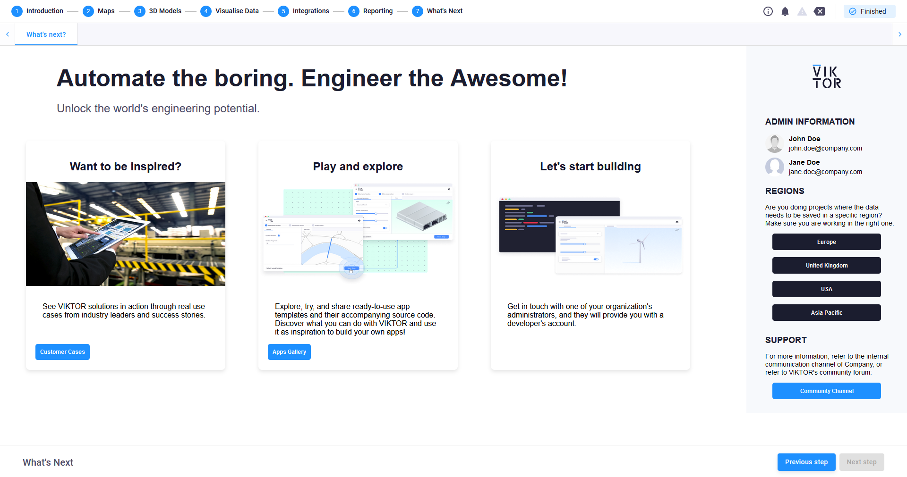

# Company info app

This application demonstrates how you can set up an application to provide information to the users. For this case,
a page is set up to present to users inspiring content, whether they are users or developers, as well as contact 
information of administrators of the platform. In the event that an organization's platform has different regions, this
is also presented.

In the following chapter are the steps to change the last step to your organization's content and contacts.

## Info page setup

The info page can be configured with the organization's own information and content. Here is an image of 
the default page:

To tailor this page to your organization's wishes, change the [info_input.json](info_page/info_input.json) file's 
input with the information of your organization. You can change the following information:

**Company info**
- name
- logo
- primary_color

**Administrator info**
- Name and Surname
- Email
- Profile photo

**Regions**
- Description of why regions are important to the organization
- Name of region
- URL

*If an organization only has one region, keep the region list empty*

**Main page**
- Title
- Subtitle
